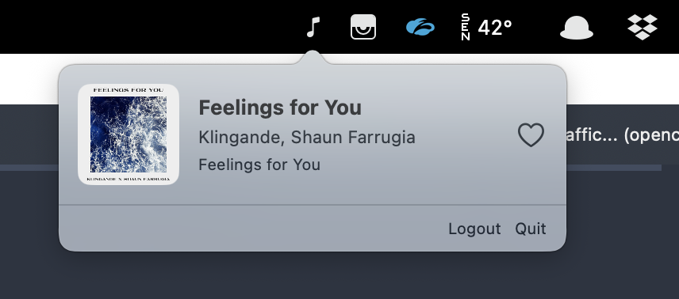

# Spoted

A lightweight macOS menu bar app that shows the currently playing Spotify track and lets you add it to your Liked Songs with a single click.



## Features

- Lives in the menu bar — no Dock icon, no window clutter
- Shows album artwork, track name, artist and album
- Heart button to like/unlike the current track
- Auto-refreshes every 3 seconds
- OAuth PKCE authentication (no client secret needed)
- Tokens stored securely in the macOS Keychain

## Requirements

- macOS 13.0+
- Swift 5.9+ (Xcode Command Line Tools)
- A [Spotify Premium](https://www.spotify.com/premium/) account
- A [Spotify Developer](https://developer.spotify.com/dashboard) app configured with:
  - **Redirect URI:** `spoted://callback`
  - **Web API** enabled
  - Your Spotify email added in **User Management** (required for dev mode)

## Setup

1. **Clone the repository**

   ```bash
   git clone https://github.com/ghostwan/Spoted.git
   cd Spoted
   ```

2. **Configure your Spotify Client ID**

   Edit `Sources/Spoted/SpotifyConfig.swift` and replace the `clientID` value with your own:

   ```swift
   static let clientID = "your_client_id_here"
   ```

3. **Build and run**

   ```bash
   ./build.sh && open Spoted.app
   ```

   The `build.sh` script compiles the Swift package and bundles it into a `.app` with the proper `Info.plist` (required for the `spoted://` URL scheme callback).

4. **Connect to Spotify**

   Click the music note icon in the menu bar, then click **Connect with Spotify**. You'll be redirected to Spotify to authorize the app, then back to Spoted.

## Architecture

```
Sources/Spoted/
├── SpotedApp.swift          # App entry point
├── AppDelegate.swift        # Menu bar setup, popover, URL scheme handler
├── SpotifyManager.swift     # OAuth PKCE, Spotify API calls, polling
├── SpotifyModels.swift      # Codable models for Spotify API responses
├── SpotifyConfig.swift      # Client ID, redirect URI, scopes, API URLs
├── KeychainHelper.swift     # Keychain CRUD for token persistence
└── PlayerView.swift         # SwiftUI views (login, player, track info)
```

## Debugging

Logs are written to `/tmp/spoted.log`. To follow them in real time:

```bash
tail -f /tmp/spoted.log
```

## License

[MIT](LICENSE)
